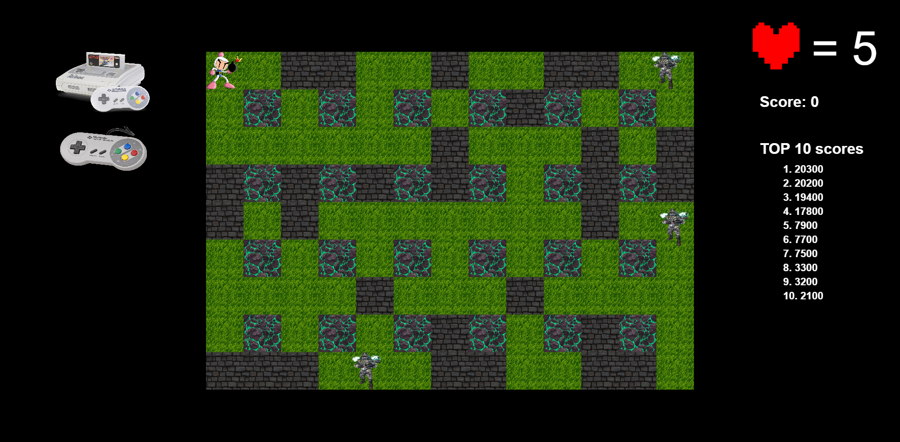
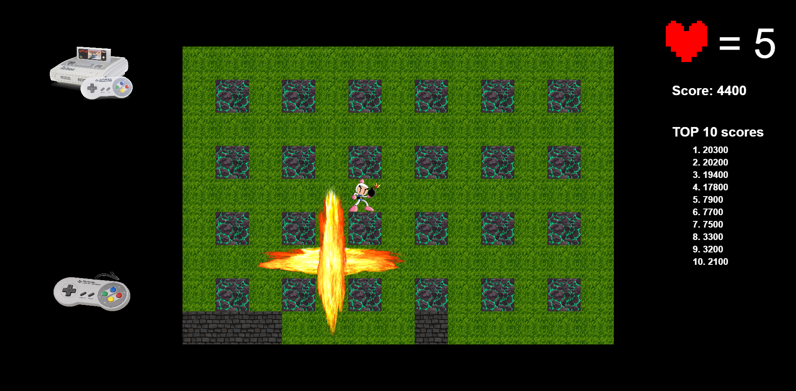
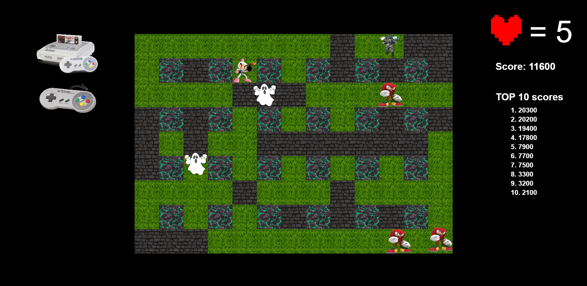
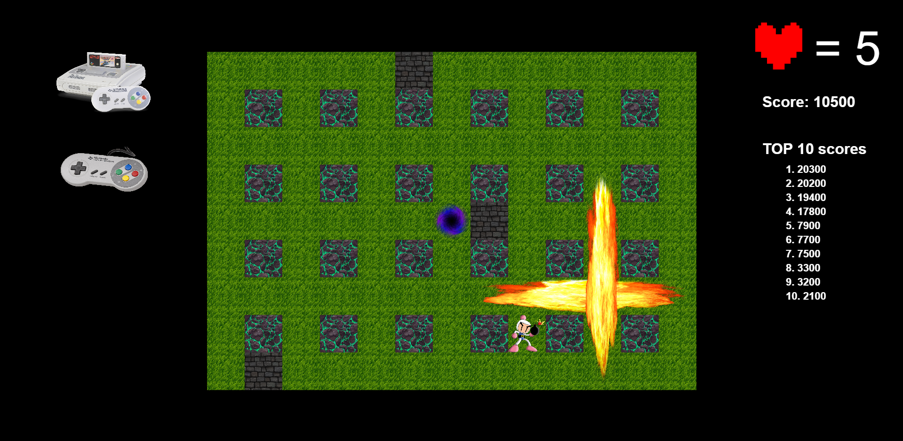

1) For start the game you need install pixi.js and Vite:
### npm install pixi.js 
### npm install @pixi/ui
### npm install vite --save-dev

2) Now you can launch the game in local server:
### npm run start

3) Use the arrow keys (right, up, down, left) to move your character.

4) Press the Spacebar to place a bomb.

5) Blow up the walls and collect the bonuses hidden underneath. There are several types: increased explosion radius, ability to place multiple bombs at once, an extra life.

6) To complete the level, you need to blow up all the enemies, find the teleport hidden under one of the walls, and enter it.

