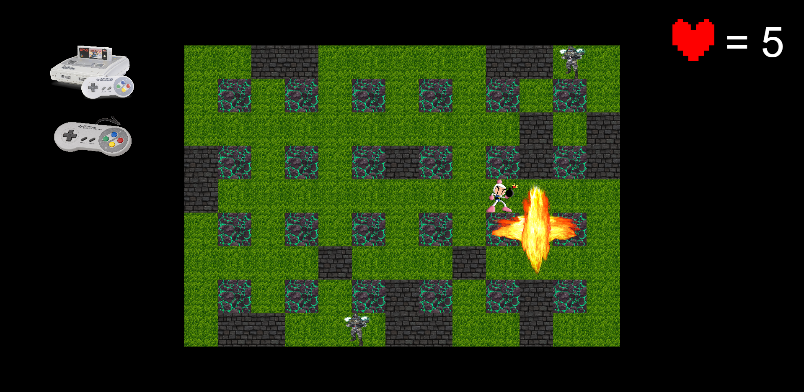
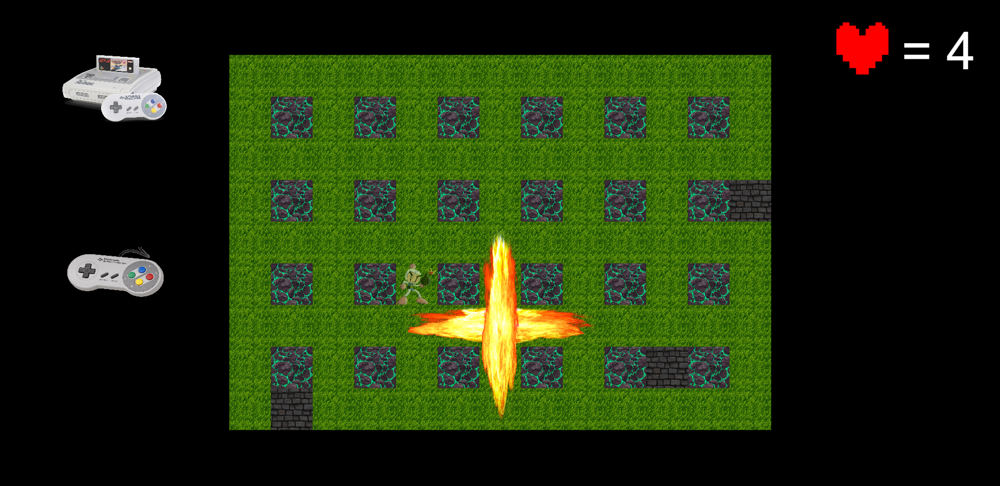
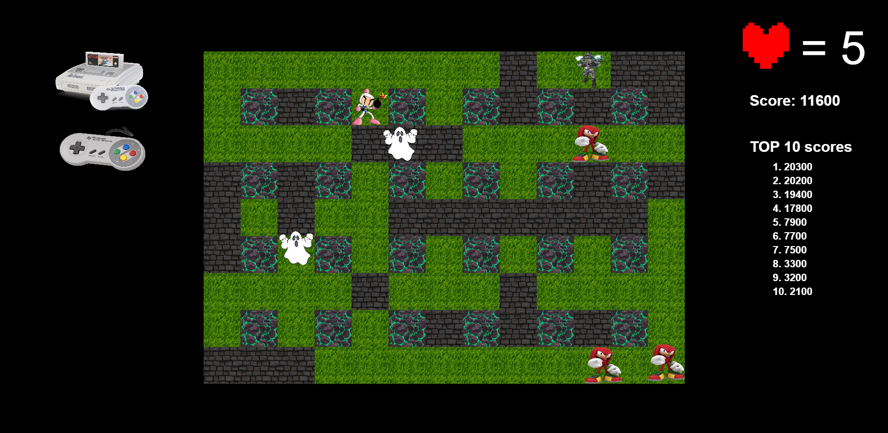

1) For start the game you need install pixi.js and Vite:
### npm install pixi.js 
### npm install vite --save-dev

2) Now you can launch the game in local server:
### npm run start

3) Use the arrow keys (right, up, down, left) to move your character.

4) Press the Spacebar to place a bomb.

5) Blow up the walls and collect the bonuses hidden underneath. There are several types:
a) Increased explosion radius
b) Ability to place multiple bombs at once
c) An extra life

